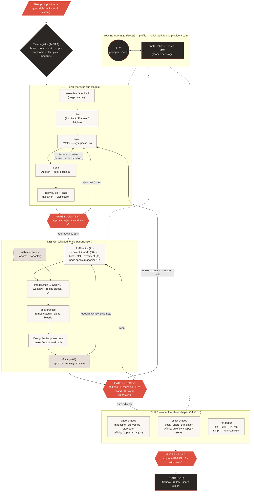
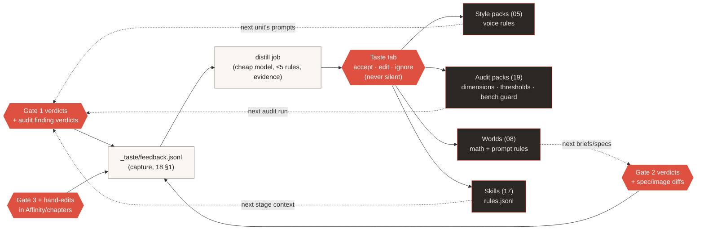

# Quire — Master Workflow Diagram

> The improved version of the hand-drawn workflow (2026-09-01), consistent with
> plans 14 (pipeline), 15/20/21 (model/harness/agents), 19 (audit), 18 (taste),
> 09 (images), 04 (gallery). Renders with Mermaid.

## 1. The macro pipeline (same for every type; sub-stages vary per type)



Key properties (what the arrows enforce):

- **Auto-advance (14):** approving the last unit at a gate *starts* the next stage;
  the last artifact landing *opens* the next gate. No dead ends between stages.
- **Withdraw ↺ on every gate:** reopens editing, preserves counters/history,
  marks downstream artifacts stale, cancels running downstream jobs (14 §2.1).
- **Same flow, different bodies:** magazine differs only inside the boxes
  (per-page briefs/specs, beauty gate at spread size); books differ by image count
  (openers/tailpieces/plates) and reflow build — the gates never differ.

## 2. The learning loops (every gate feeds something)



## 3. Diffs vs the hand-drawn original

1. **Gates drawn explicitly** — the three approval diamonds (with withdraw) are the
   control surface; the original flowed Content→Image→Affinity without them.
2. **Audit is inside Content**, not a separate satellite — and it learns via audit
   packs (19), so "Style and Skill Improvement" feeds audit too, not only writing.
3. **Design System box became two things**: Worlds (08, the data) and the
   ArtDirector/DesignAuditor agents (21, the users of it); feedback reaches worlds
   through the Taste tab, never directly.
4. **Affinity split into three build shapes** — the original had one Affinity node;
   books/shorts need the reflow script, script/film/play never touch Affinity.
5. **Gallery + reference dumping** added between generation and the design gate.
6. **Model plane routes per agent** (profiles = agent names, 21), not one global LLM.
```
